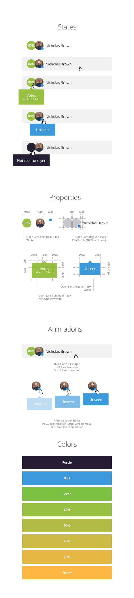

# Indivizo Frontend Exercise
Hey!

The goal of this exercise so we can accurately evaluate how you think about, write and organize code in a real-life situation.

Here is how to get started:

## Process
Clone this repository, create a new branch, push your commits there. We are eager to see how you structure your changes, so please commit as often as you prefer.

When you are ready, create a pull request to the master branch and we'll check back to you as soon as we can.

## The exercise

* Create a similar [React](https://facebook.github.io/react/) component as the picture above.
* Create a simple page where you show a few of the applicants under each other in different states.
* Include a task runner definition of your choice, so we can examine your solution with one command.

### Specification
The components represents an applicant in our system. It has the following features:

* A percentage widget represents how well the applicant did compared to our requirements. The background color changes based on the precentage. A tooltip shows the number of votes in two category: Approved and Rejected votes. The percentage is caluclated based on the number of approved votes divided by all the votes.
* The avatar widget is the picture for the applicant. If the applicant did not include a picture, we show the initials on a gray background.
* The blue indicator shows if the applicant is new in the system.

We have 2 display modes to render this component:

* **Photo with name**: We show the photo and the name of the applicant.
* **Photo with name and percentage**: Just like above, showing the percentage with the accurate color. If we don't have votes, we show a dark purple background instead of the percentage.

Take these parameters as properties. You do not need to store any state.

#### Tools
Use [React](https://facebook.github.io/react/) and [Sass](http://sass-lang.com/) to complete the exercise.

You are welcome to use any open-source 3rd party tools and plugins to make your task easier (including, but not limited to: jQuery, compass, npm, bower, browserify, babeljs).
If you choose to include any package manager, make sure you include the definition file for it.

## Need any help?

Do not hesitate to contact our team.

*The Indivizo Team*
